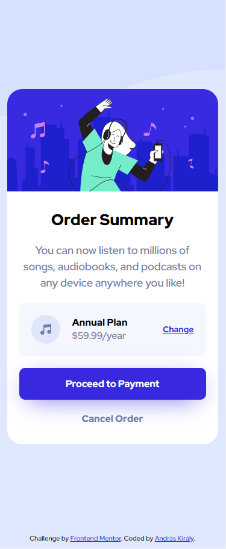

# Frontend Mentor - Order summary card solution

This is a solution to the [Order summary card challenge on Frontend Mentor](https://www.frontendmentor.io/challenges/order-summary-component-QlPmajDUj). Frontend Mentor challenges help you improve your coding skills by building realistic projects. 

## Table of contents

- [Overview](#overview)
  - [The challenge](#the-challenge)
  - [Screenshot](#screenshot)
  - [Links](#links)
- [My process](#my-process)
  - [Built with](#built-with)
- [Author](#author)

## Overview

### The challenge

Users should be able to:

- See hover states for interactive elements

### Screenshot

### Links

- Solution URL: [solution URL](https://www.frontendmentor.io/solutions/flexbox-vanilla-css-pupZSfKUZn)
- Live Site URL: [live site URL](https://github.com/Pr3t0r/order-summary-component-main)

## My process

### Built with

- VSCODE
- CSS custom properties
- without framework
- Mobile-first workflow
- flexbox
- eye sighting (no exact sizes were available except paragraphs)

## Author

- Frontend Mentor - [@Pr3t0r](https://www.frontendmentor.io/profile/Pr3t0r)